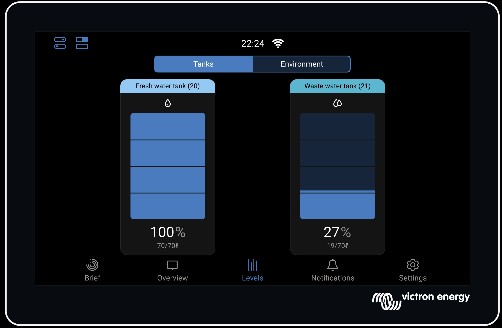

# dbus-ads1115
ADS1115 ADC Sensor Integration for Victron Energy Venus OS.

This service allows you to connect resistive sensors (like water level, fuel, or temperature sensors) to your Victron system using a cheap and highly accurate ADS1115 16-bit ADC.

## 🚀 Features
- **Multi-channel support:** Use all 4 channels of the ADS1115.
- **Smart Calibration:** Easy min/max resistance setup via YAML.
- **Venus OS Integration:** Appears as a native Tank sensor in the GUI/Remote Console.
- **Direct SMBus Access:** Uses `smbus2` for direct I2C communication — no kernel driver required. Avoids the broken `ti-ads1015` kernel driver which has inverted channel ordering and multiplexing instability.
- **Auto-installed Dependencies:** `smbus2` is automatically installed by the setup script on every install and firmware-update. No manual steps needed.

## 📸 Screenshots

Tank sensors appear as native tank devices in Venus OS:



## 🛠 Hardware Setup

### Required Components
- ADS1115 16-bit ADC module
- 220Ω resistor (one per sensor)
- Resistive level sensor (e.g., 0-190Ω tank sensors)
- Jumper wires

### ADS1115 to Raspberry Pi Connection

```
ADS1115 Module          Raspberry Pi GPIO Header
┌────────────┐         ┌─────────────────────────┐
│  VDD   (1)  │────────►│ Pin 1  (3.3V Power)     │
│  GND   (2)  │────────►│ Pin 9  (Ground)         │
│  SCL   (3)  │────────►│ Pin 5  (I2C SCL, GPIO3) │
│  SDA   (4)  │────────►│ Pin 3  (I2C SDA, GPIO2) │
│  ADDR  (5)  │────────►│ Pin 9  (Ground)         │ ← I2C address to 0x48
│  ALRT  (6)  │          │                         │
│  A0    (7)  │◄────┐   │                         │
│  A1    (8)  │◄──┐ │   │                         │
│  A2    (9)  │   │ │   │                         │
│  A3   (10)  │   │ │   │                         │
└────────────┘   │ │  └─────────────────────────┘
                  │ │
          Sensors │ │ (see diagrams below)
```

### Single Tank Wiring Diagram

For one tank sensor on channel A0:

```
                    ┌─────────────────────────────────────┐
                    │           ADS1115 Module            │
                    │                                     │
    3.3V ───────────┼─── VDD                              │
                    │                                     │
    GND  ───────────┼─── GND                              │
                    │                                     │
                    │         ┌─────────────┐             │
    3.3V ───[220Ω]──┼─────────┤ A0          │             │
                    │         │             │             │
                    │         └─────────────┘             │
                    │              │                      │
                    │              ▼                      │
                    │         ╔═════════════╗             │
                    │         ║   SENSOR    ║   A5-E225   │
                    │         ║   0-190Ω    ║   (225mm)   │
                    │         ╚═════╤═══════╝             │
                    │               │                      │
    GND  ───────────┼───────────────┘                      │
                    │                                     │
                    └─────────────────────────────────────┘
```

**How it works:**
- The 220Ω resistor and sensor form a voltage divider
- As the tank level changes, the sensor resistance changes
- The ADS1115 measures the voltage at the junction point
- Software calculates the sensor resistance and tank level

### Dual Tank Wiring Diagram

For two tank sensors on channels A0 and A1:

```
                    ┌─────────────────────────────────────┐
                    │           ADS1115 Module            │
                    │                                     │
    3.3V ───────────┼─── VDD                              │
                    │                                     │
    GND  ───────────┼─── GND                              │
                    │                                     │
                    │    ┌─────────────┐                  │
                    │    │             │                  │
    3.3V ───[220Ω]──┼────┤ A0          │                  │  FRESH WATER
                    │    │             │                  │  ────────────
                    │    └─────────────┘                  │
                    │         │                           │
                    │         ▼                           │
                    │    ╔═════════════╗                  │
                    │    ║   SENSOR    ║   A5-E225        │
                    │    ║   0-190Ω    ║   (225mm)        │
                    │    ╚═════╤═══════╝                  │
                    │          │                          │
    GND  ───────────┼──────────┘                          │
                    │                                     │
                    │    ┌─────────────┐                  │
                    │    │             │                  │
    3.3V ───[220Ω]──┼────┤ A1          │                  │  GREY WATER
                    │    │             │                  │  ──────────
                    │    └─────────────┘                  │
                    │         │                           │
                    │         ▼                           │
                    │    ╔═════════════╗                  │
                    │    ║   SENSOR    ║   A5-E125        │
                    │    ║   0-190Ω    ║   (125mm)        │
                    │    ╚═════╤═══════╝                  │
                    │          │                          │
    GND  ───────────┼──────────┘                          │
                    │                                     │
                    └─────────────────────────────────────┘
```

**Important Notes:**
- Each sensor needs its own 220Ω pull-up resistor
- Each sensor connects to a different ADC channel (A0, A1, A2, or A3)
- All sensors share the same 3.3V and GND rails
- Up to 4 tanks can be monitored with a single ADS1115

### Supported Sensor Types

| Model   | Length | Resistance Range | Typical Use      |
|---------|--------|------------------|------------------|
| A5-E225 | 225mm  | 0-190Ω           | Fresh water tanks|
| A5-E125 | 125mm  | 0-190Ω           | Grey water tanks |
| Custom  | Any    | Any resistive    | Fuel, oil, etc.  |

## 📥 Installation

### Method 1: Via PackageManager (Recommended)

**Prerequisites:**
- SetupHelper and PackageManager must be installed on your VenusOS device
- See https://github.com/kwindrem/SetupHelper for installation instructions

**Installation steps:**

1. **Via GUI:**
   - Navigate to `Settings -> PackageManager` on your Venus display
   - Select "Add package"
   - Enter package info:
     - Owner: `alexsanzder`
     - Repository: `dbus-ads1115`
     - Branch/Tag: `latest`
   - Click "Add" and the package will be downloaded and installed automatically

2. **Via USB/SD Card:**
   - Download release archive from GitHub releases page
   - Copy to root of freshly formatted USB stick or SD card
   - Insert into GX device and reboot
   - Package will install automatically

3. **Via SSH/Command Line:**
   ```bash
   wget -qO - https://github.com/alexsanzder/dbus-ads1115/archive/latest.tar.gz | tar -xzf - -C /data
   rm -rf /data/dbus-ads1115
   mv /data/dbus-ads1115-latest /data/dbus-ads1115
   /data/dbus-ads1115/setup
   ```

**Configuration:**
- After installation, edit `/data/dbus-ads1115/config.yml` to match your resistor values and tank capacity
- Restart the service: `svc -t /service/dbus-ads1115`

**Verification:**
- The sensor should appear in `Settings -> Devices` on your Venus display within 5 minutes

### Automatic Reinstallation

When using PackageManager/SetupHelper, this package will automatically reinstall after VenusOS firmware updates. No manual intervention required!

## ⚙️ Configuration (`config.yml`)

### Single Tank Configuration

```yaml
i2c:
  bus: 1
  address: 0x48
  reference_voltage: 3.3

sensors:
  - type: tank
    enabled: true                 # Set to false to disable this sensor
    name: "Fresh Water Tank"
    channel: 0                    # ADS1115 channel (0-3)
    fixed_resistor: 220           # Pull-up resistor in Ohms
    sensor_min: 0.2               # Resistance when empty
    sensor_max: 189.8             # Resistance when full
    tank_capacity: 70             # Capacity in your chosen unit
    volume_unit: liters           # liters | cubic_meters | gallons_us | gallons_imp
    fluid_type: fresh_water
    update_interval: 3000         # Update every 3 seconds
    product_name: "A5-E225 (0-190Ω, 225mm)"
    product_id: 0xA5225           # Numeric product ID for VRM Portal (hex or int)
```

### Dual Tank Configuration

```yaml
i2c:
  bus: 1
  address: 0x48
  reference_voltage: 3.3

sensors:
  # Fresh Water Tank - Channel A0
  - type: tank
    enabled: true
    name: "Fresh Water Tank"
    channel: 0
    fixed_resistor: 220
    sensor_min: 0.2
    sensor_max: 189.8
    tank_capacity: 70             # 70 Liters
    volume_unit: liters           # liters | cubic_meters | gallons_us | gallons_imp
    fluid_type: fresh_water
    update_interval: 3000
    product_name: "A5-E225 (0-190Ω, 225mm)"
    product_id: 0xA5225

  # Grey Water Tank - Channel A1
  - type: tank
    enabled: false                # Set to true when sensor is wired
    name: "Grey Water Tank"
    channel: 1
    fixed_resistor: 220
    sensor_min: 0.2
    sensor_max: 189.8
    tank_capacity: 70             # 70 Liters
    volume_unit: liters           # liters | cubic_meters | gallons_us | gallons_imp
    fluid_type: waste_water
    update_interval: 3000
    product_name: "A5-E125 (0-190Ω, 125mm)"
    product_id: 0xA5125
```

### Configuration Parameters

| Parameter       | Description                                      |
|-----------------|--------------------------------------------------|
| `enabled`       | Set to `false` to disable a sensor (no D-Bus service, no ADC read) |
| `name`          | Display name in Venus OS                         |
| `channel`       | ADS1115 input channel (0=A0, 1=A1, 2=A2, 3=A3)   |
| `fixed_resistor`| Pull-up resistor value in Ohms (typically 220Ω)  |
| `pga`           | Programmable Gain Amplifier voltage range (default 2.048V) |
| `sensor_min`    | Sensor resistance at EMPTY position (Ohms)       |
| `sensor_max`    | Sensor resistance at FULL position (Ohms)         |
| `tank_capacity` | Tank capacity in the unit specified by `volume_unit` |
| `volume_unit`   | Unit for `tank_capacity`: `liters`, `cubic_meters`, `gallons_us`, `gallons_imp` (default: `cubic_meters`) |
| `fluid_type`    | `fresh_water`, `waste_water`, `fuel`, etc.       |
| `update_interval`| How often to read sensor (milliseconds)         |
| `product_name`  | Custom product name shown in device info         |
| `product_id`    | Numeric product ID for VRM Portal (hex or int, e.g. `0xA5225`) |

> **Note on display units:** The driver always converts `tank_capacity` to m³ internally — this is what Venus OS stores on D-Bus. The **display unit** shown in the GUI (Liters, Gallons, etc.) is a **system-wide** setting on your Cerbo GX / Venus OS device:
> `Settings → System setup → Volume unit`
> (0 = m³ · 1 = Liters · 2 = US gallons · 3 = Imperial gallons)

### Per-Sensor Alarms (Optional)

Each sensor can define low and high level alarms:

```yaml
sensors:
  - type: tank
    name: "Fresh Water Tank"
    # ... other config ...
    alarms:
      low:
        enable: true
        active: 20         # Trigger alarm when level < 20%
        restore: 25       # Clear alarm when level > 25%
        delay: 30         # Delay in seconds before triggering
      high:
        enable: true
        active: 90         # Trigger alarm when level > 90%
        restore: 85       # Clear alarm when level < 85%
        delay: 5
```

| Alarm Parameter | Description |
|-----------------|-------------|
| `enable`        | Set to `true` to enable the alarm |
| `active`        | Level percentage that triggers the alarm |
| `restore`       | Level percentage that clears the alarm |
| `delay`         | Seconds to wait before triggering (prevents flapping) |

### Fluid Types

Available fluid types for Venus OS:
- `fresh_water` - Fresh/potable water
- `waste_water` - Grey water
- `fuel` - Diesel/gasoline
- `oil` - Motor oil
- `live_well` - Live well (fishing boats)
- `black_water` - Sewage
- `gasoline` - Gasoline fuel
- `diesel` - Diesel fuel
- `lng` - Liquefied Natural Gas
- `lpg` - Liquefied Petroleum Gas
- `hydraulic_oil` - Hydraulic oil

## 🔧 Calibration

1. **Empty Tank Calibration:**
   - Disconnect sensor wire from ADC
   - Measure sensor resistance with multimeter
   - Set `sensor_min` to this value

2. **Full Tank Calibration:**
   - Fill tank to known level (100%)
   - Measure sensor resistance
   - Set `sensor_max` to this value

3. **Fine-tuning:**
   - Check readings in Venus OS
   - Adjust min/max values as needed
   - Restart service: `svc -t /service/dbus-ads1115`

## 📜 License
This project is released under the MIT License.
